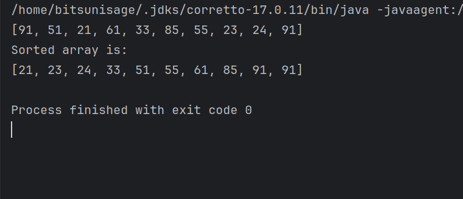

## Bubble Sort
- ### [Theory](../../Theory/DATA%20STRUCTURES%20AND%20ALGORITHMS/Sorting/Handwritten%20notes%20on%20bubble%20sort.pdf) 

- ### [Video Explanation](https://www.youtube.com/embed/F5MZyqRp_IM)    
- ### [Program](../DSA/CollegeFiles/src/com/BitsUniSage/Sorting/BubbleSort.java) 

```Java
package com.subodh.Sorting;

import java.util.Arrays;
import java.util.Random;

public class BubbleSort {
    public static void main(String[] args) {
//        int[] arr = {94,14,8,41,71,2,38,96,92,31};
        int[] arr = new int[10];
        randomNumber(arr);

        System.out.println(Arrays.toString(arr));
        bubbleSort(arr);
        System.out.println("Sorted array is: \n" + Arrays.toString(arr));


    }

    public static void randomNumber(int[] arr) {
        Random r = new Random();
        for (int i = 0; i < arr.length; i++) {
            arr[i] = r.nextInt(99);
//			System.out.println("Generated number: " + arr[i]);

        }

    }

    public static void bubbleSort(int[] arr) {
        for (int i = 0; i < arr.length; i++) {
            for (int j = 1; j < arr.length - i; j++) {
                if (arr[j] < arr[j - 1]){
                    Swapping.swap(arr, j, j - 1);
                }
            }
        }
    }


}
```
### Output
