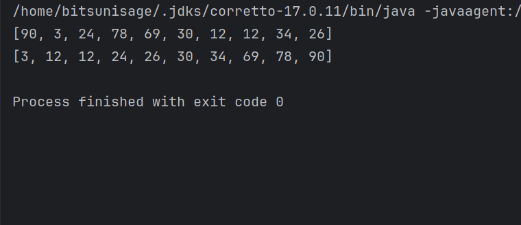
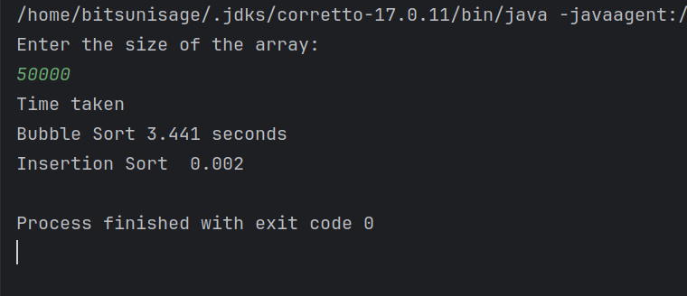

## Insertion Sort
- ### [Explanation](../../Theory/DATA%20STRUCTURES%20AND%20ALGORITHMS/Sorting/Handwritten%20Notes%20on%20Insertion%20Sort.pdf.pdf)
- ### [Video Explanation](https://www.youtube.com/watch?v=By_5-RRqVeE&pp=ygUdaW5zZXJ0aW9uIHNvcnQgZHNhIHdpdGgga3VuYWw%3D)
- ### [Program](../DSA/CollegeFiles/src/com/BitsUniSage/Sorting/InsertionSorting.java)
```Java
 package com.subodh.Sorting;

import java.util.Arrays;

public class InsertionSorting {
    public static void main(String[] args) {
//        int[] arr = {7,9,5,1,10,-3};
        int[] arr = new int[10];

        BubbleSort.randomNumber(arr);


        System.out.println(Arrays.toString(arr));
        sort(arr);
        System.out.println(Arrays.toString(arr));

    }

    public static void sort(int[] arr) {
        for (int i = 1; i < arr.length; i++) {
            int j = i;

            while (j > 0 && (arr[j] < arr[j - 1])) {

                Swapping.swap(arr, j, j - 1);
                j--;
            }

        }

    }
}


```
### Output  
 

## Run time Comparision of Insertion sort and bubble sort using the same array 
- ### [Program](../DSA/CollegeFiles/src/com/BitsUniSage/Sorting/bubbleAndInsertionComparision.java)  
  ``` Java 
  package com.subodh.Sorting;

    import java.time.Clock;
    import java.util.Scanner;


    public class bubbleAndInsertionComparison {
        public static void main(String[] args) {
            int[] bubbleSortArray;
            int[] insertionSortArray;

            Scanner input = new Scanner(System.in);
            Clock c = Clock.systemUTC();

            System.out.println("Enter the size of the array:");
            int size = input.nextInt();
            int[] arr = new int[size];
            BubbleSort.randomNumber(arr);

            insertionSortArray = bubbleSortArray = arr.clone();


            //Calling the bubble sort function and observing the system clock
            long initTimeBs = c.millis();
            BubbleSort.bubbleSort(bubbleSortArray);
            long finalTimeBs = c.millis();

            //Calling the insertion sort function
            long initTimeIs = c.millis();
            InsertionSorting.sort(insertionSortArray);
            long finalTimeIs = c.millis();

            System.out.println("Time taken \nBubble Sort\t" + ((finalTimeBs - initTimeBs) / 1000.0) + " seconds\nInsertion Sort\t" + ((finalTimeIs - initTimeIs) / 1000.0));


        }


    }
  ```
  ### Output


### <u> Important thing to note </u>
- Note that in this program the run time for both the sorting algorithms are being compared.
- The time complexity for both the sorting algorithms are same i.e.,
  - Best Case: O(n)
  - Worst Case O(n^2)
- The run time for both the algorithms can be different according to the arrays used, the configuration of the system running the program and more other factors. 
