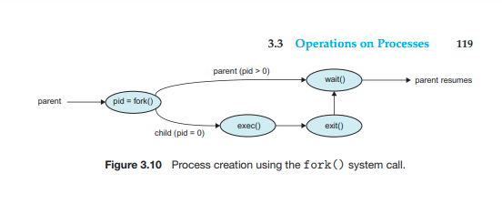
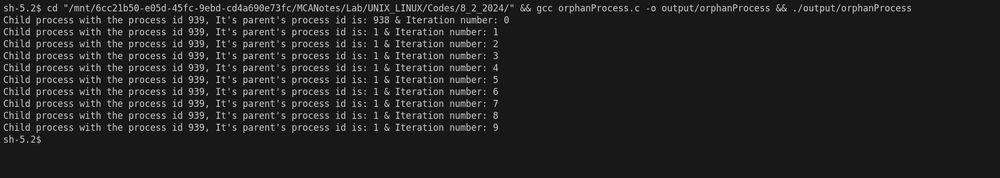
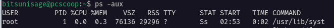
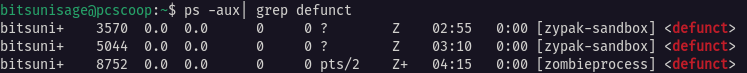
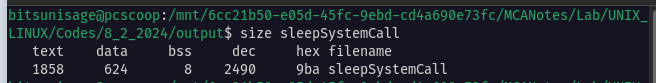

 ## [Fork System Call](../Codes/8_2_2024/forkSystemCall.c)
 ```C
#include<stdio.h>
#include<unistd.h>
#include<sys/types.h>
    void main(){
        pid_t pid;
        pid = fork();
        if(pid==0){
            printf("Child process created with the id %u \n", getpid());

        }else if(pid>0){
            printf("Parent process with the id %u \n", getpid());
    }
}
 ```
- The fork system call in unix is used to create a child process using C 
programming lanaguage.  
- The kthreadd process is responsible for creating additional processes that perform tasks on behalf of the kernel.
- On UNIX and Linux systems, we can obtain a listing of processes by using the ps command. For example, the command `ps -el` will list complete information for all processes currently active in the system.  
 ### When a process creates a new process, two possibilities for execution exist:
1. The parent continues to execute concurrently with its children.
2. The parent waits until some or all of its children have terminated if the `wait(NULL)` system call has been executed inside the code block of parent.
### There are also two address-space possibilities for the new process:
1. The child process is a duplicate of the parent process (it has the same
program and data as the parent).
2. The child process has a new program loaded into it. By using the `exec()` system call in the child process it can be freed from the parent data. 
### Execution of fork System Call



## [Using for loop in both parent and child](../Codes/8_2_2024/forLoopForChildAndParent.c) 
```C
#include <stdio.h>
#include <unistd.h>
#include <sys/types.h>
void main()
{
    pid_t pid;
    pid = fork();
    if (pid == 0)
    {

        for (int i = 0; i < 10; i++)
        {
            printf("Child process with the process id %u & Iteration number: %d \n", getpid(), i);
        }
    }
    if (pid > 0)
    {

        for (int i = 0; i < 10; i++)
        {
            printf("Parent process with the process id %u & Iteration number: %d \n", getpid(), i);
        }
    }
}
```
- In this code Concurrent execution of parent and child are observed.
-  At some point of time the parent is being executed and at some time child. This condition is often known as **Race Condition**  
- The synchronization of both the process is absent and without proper synchronization, concurrent processes can lead to unpredictable results.
- If a shared variable is used between two processes there may arise a condition where any one of the process hasn't completed the updation of the value and in between another process starts its execution.  

## [Using Wait System Call](../Codes/8_2_2024/waitSystemCall.c)  
```C
// Using wait system call for parent to wait till the child is being executed
#include <stdio.h>
#include <unistd.h>
#include <sys/types.h>
// Header file to use wait() system call
#include<sys/wait.h>
void main()
{
    pid_t pid;
    pid = fork();
    if (pid==0)
    {
        
        for (int i = 0; i < 10; i++)
        {
            printf("Child process with the process id %u & Iteration number: %d \n",getpid(),i);
        }
        
    }
     if (pid>0)
     {
        // This method will force the parent process to wait till its any child finishes executing
        wait(NULL);
       
        for (int i = 0; i < 10; i++)
        {
            printf("Parent process with the process id %u & Iteration number: %d \n",getpid(),i);
        }
     }
        
    
}
```
- To prevent the race condition `wait()` system call can be used.
- By using `wait()`, the parent ensures that it does not perform operations that depend on the child's work until the child has completed, thus maintaining proper synchronization and preventing race conditions.
- Only after the termination of its child the parent processes executes.
- The `wait()` system call can accept different types of arguments:  
  - **NULL**: When **NULL** is passed as the argument to `wait()`, the parent process does not care about the termination status of the child process. It only waits for the child process to terminate.
- To use the `wait()` the following header file needs to be added in the program:
``` C  
    #include<sys/wait.h>  
```  
## [Using Sleep Method](../Codes/8_2_2024/sleepSystemCall.c)
```C
// Using sleep system call for parent to wait till the child is being executed
#include <stdio.h>
#include <unistd.h>
#include <sys/types.h>
void main()
{
    pid_t pid;
    pid = fork();
    if (pid==0)
    {
        
        for (int i = 0; i < 10; i++)
        {
            printf("Child process with the process id %u & Iteration number: %d \n",getpid(),i);
        }
        
    }
     if (pid>0)
     {
        // It forces the parent process to sleep for two seconds. The time unit is passed in the sleep method as argument
        sleep(5);
       
        for (int i = 0; i < 10; i++)
        {
            sleep(1);
            printf("Parent process with the process id %u & Iteration number: %d \n",getpid(),i);
        }
     }
        
    
}
```
- Instead of using `wait()` sleep method can be used which accepts time to sleep in seconds.  
- If the child process finishes its executin within the time parent is sleeping then no problem occurs but if it doesn't then problem may arise.
- So, using `wait()` is a better option

### [Orphan Process](../Codes/8_2_2024/orphanProcess.c)
```C
#include <stdio.h>
#include <unistd.h>
#include <sys/types.h>
// Header file to use wait() system call
#include <sys/wait.h>
#include <stdlib.h>
void main()
{
    pid_t pid;
    pid = fork();
    if (pid == 0)
    {
        

        for (int i = 0; i < 10; i++)
        {
            printf("Child process with the process id %u, It's parent's process id is: %u & Iteration number: %d \n", getpid(), getppid(), i);
        }
    }
    if (pid > 0)
    {

        // Forcely terminating the parent immediately after creating its child
        exit(0);
    }
}
```
  

- An orphan process is the process whose parent has already been terminated but the child is still running.
- So, when we try to print the process id of the orphan process's parent the it shows 1.
- The process with process id 1 is the init process which is the root process of all the process in a system.
-  

## [Zombie Process](../Codes/8_2_2024/zombieprocess.c)
```C
// Using wait system call for parent to wait till the child is being executed
#include <stdio.h>
#include <unistd.h>
#include <sys/types.h>
// Header file to use wait() system call
#include <sys/wait.h>
void main()
{
    pid_t pid;
    pid = fork();
    if (pid == 0)
    {

        for (int i = 0; i < 10; i++)
        {
            printf("Child process with the process id %u & Iteration number: %d \n", getpid(), i);
        }
    }
    if (pid > 0)
    {

        printf("Parent process with the process id %u  \n", getpid());
        sleep(30);
    }
}
```
#### Execution
```Bash
#Compiling the program
gcc zombieprocess.c -o zombieprocess
#Running the program
./zombieprocess
```
#### Open a new terminal and run the following command to see the status
```Bash
ps -aux | grep defunct
# defunct denotes the zombie process and grep is used to filter out there results
```
-  
-  
- A process whose status is not yet fetched is called zombie process.
- A zombie process or defunct process is a process that has completed execution (via the exit system call) but still has an entry in the process table. This occurs for the child processes, where the entry is still needed to allow the parent process to read its child's exit status. Once the exit status is read via the wait system call, the zombie's entry is removed from the process table and said to be "reaped".
  
## Size command in linux
- The size command will display the output that will give you information on the size command in 5 values like data, text, dec, bss, and hex as given below.

-  
- It displays the  requirement information about the memory spaces of different section needed by the program when executed


