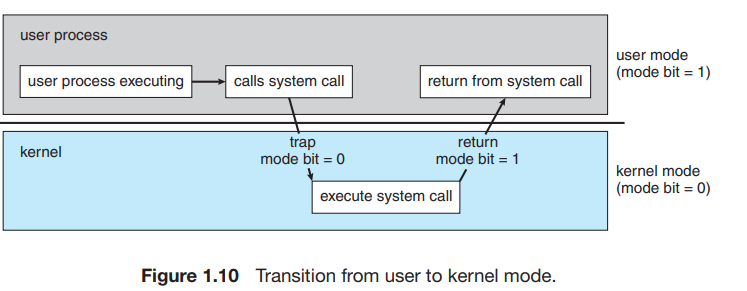

## Dual User and Multimode Operation

- In order to ensure the proper execution of the operating system, we must be able to distinguish between the execution of operating-system code and userdefined code. The approach taken by most computer systems is to provide hardware support that allows us to differentiate among various modes of
execution.
  

- At the very least, we need two separate modes of operation: `user mode` and `kernel mode` (also called supervisor mode, system mode, or privileged mode)
-  A bit, called the mode bit, is added to the hardware of the computer to indicate the current mode: kernel (0) or user (1). With the mode bit, we can distinguish between a task that is executed on behalf of the operating system
and one that is executed on behalf of the user.
 ### Post Note
- At system boot time, the hardware starts in kernel mode. The operating system is then loaded and starts user applications in user mode. Whenever a trap or interrupt occurs, the hardware switches from user mode to kernel mode
(that is, changes the state of the mode bit to 0). Thus, whenever the operating system gains control of the computer, it is in kernel mode. The system always
switches to user mode (by setting the mode bit to 1) before passing control to
a user program. 