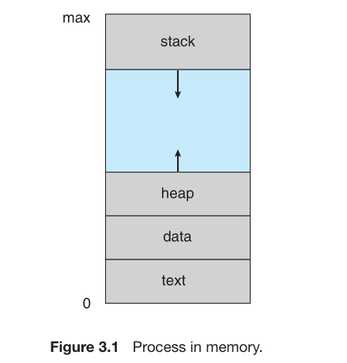
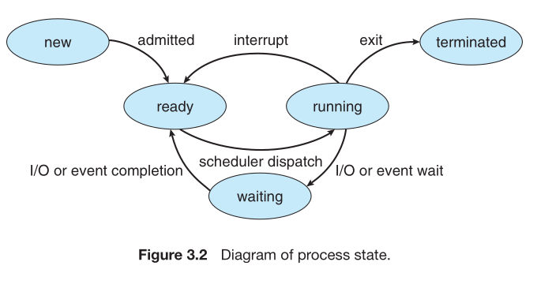
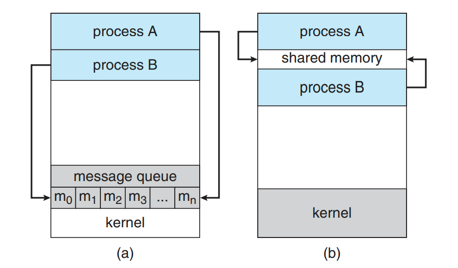

## Process Concepts

### Process
- A  process is a program in execution. A process
is more than the program code, which is sometimes known as the text section.It also includes the current activity, as represented by the value of the `program counter` and the contents of the processor’s registers. A process generally also includes the `process stack`, which contains temporary data (such as function parameters, return addresses, and local variables), and a `data section`, which contains global variables. A process may also include a `heap`, which is memory
that is dynamically allocated during process run time.

  

### Process State
As a process executes, it changes state. The state of a process is defined in part by the current activity of that process. A process may be in one of the following states:
- New. The process is being created.
- Running. Instructions are being executed.
- Waiting. The process is waiting for some event to occur (such as an I/O
completion or reception of a signal).
- Ready. The process is waiting to be assigned to a processor.
- Terminated. The process has finished execution.
  
 
  

## Types of processes
### Independent process:
  A process is independent if it cannot affect or be affected by the other processes executing in the system. Any process that does not share data with any other process is independent
### Cooperative process:
   A process is cooperating if it can affect or be affected by the other processes
executing in the system. Clearly, any process that shares data with other processes is a cooperating process. 

## Interprocess Communication

  Cooperating processes require an interprocess communication (IPC) mechanism that will allow them to exchange data and information. There are two
fundamental models of interprocess communication: shared memory and message passing.
  ### Shared Memory:
  In the shared-memory model, a region of memory that is shared by cooperating processes is established. Processes can then exchange information by reading and writing data to the shared region.
  ### Message Passing:
 In the message-passing
model, communication takes place by means of messages exchanged between
the cooperating processes.

### Figure illustrating both the forms of IPC(Interprocess Communication)

## Operating Systems

### UNIX: 
founded in the year 1969 by [Ken Thompson](https://community.cadence.com/resized-image/__size/1040x0/__key/communityserver-blogs-components-weblogfiles/00-00-00-01-06/5430.thompson01.jpg), [Dennis Ritchie](https://en.wikipedia.org/wiki/Dennis_Ritchie#/media/File:Dennis_Ritchie_2011.jpg), [Rudd Canaday](https://www.entefy.com/wp-content/uploads/2022/03/28557234dd50457fba0c51af9dcbea2f.jpg) and others at bell Laboratory
### Linux
Founded by [Linus Torvalds](https://media.newyorker.com/photos/5ba177da9eb2f7420aadeb98/master/w_1920,c_limit/Cohen-Linus-Torvalds.jpg) in 1991. It initially began as an toy operatin system for x_86 architecture systems.

### Macintosh (macOS)
Founded by [Steve Jobs](https://upload.wikimedia.org/wikipedia/commons/d/dc/Steve_Jobs_Headshot_2010-CROP_%28cropped_2%29.jpg) in 1984. The Macintosh was the first mass-market personal computer that featured an integral graphical user interface and mouse.

### Windows
Founded by [Bill Gates](https://encrypted-tbn3.gstatic.com/licensed-image?q=tbn:ANd9GcQ5q_alP8jzpTv_T3zupEpRfFIbo2qQkttFuW3AzE00-8zljPbVNRU44S_SqBOitpM143Owjd6myNdrtCo) and [Paul Allen](https://people.com/thmb/fiaOysUkmrIenD4pSVGbMVh1bAg=/750x0/filters:no_upscale():max_bytes(150000):strip_icc():focal(999x0:1001x2):format(webp)/shutterstock_editorial_5720688bq_huge-2000-d8036fa2db924efc915c0a6a75a605e6.jpg) in 1985. Windows was developed by Microsoft as a graphical operating system shell for MS-DOS.

## Dynamic Memory Allocation
- Dynamic Memory Allocation (DMA) is a process in which memory is allocated during runtime, rather than at compile time. This allows programs to use memory more efficiently and flexibly, as they can request and release memory as needed. Dynamic memory allocation is particularly useful when the size of data structures (like arrays, linked lists, etc.) cannot be determined beforehand or when handling variable-sized data.
- In programming languages like C and C++, dynamic memory allocation is managed using specific functions:
  - **malloc(size_t size)**: Allocates a block of memory of specified size (in bytes) and returns a pointer to the beginning of the block.
  - **calloc(size_t num, size_t size**): Allocates memory for an array of num elements of size bytes each and initializes all bytes to zero. Returns a pointer to the allocated memory.
  - **realloc(void *ptr, size_t size)**: Resizes the memory block pointed to by ptr to size bytes. The contents of the memory block are preserved up to the lesser of the new and old sizes.
  - **free(void *ptr)**: Deallocates the memory previously allocated by malloc, calloc, or realloc. The pointer ptr must point to the beginning of a memory block previously allocated by one of these functions.

## Bootstrap

A Bootstrap Loader is a crucial part of the boot sequence in operating systems, responsible for loading the operating system into memory when the computer is powered on or restarted. It initializes the system hardware and loads the operating system kernel and other necessary components to get the system up and running.

#### Key Functions of a Bootstrap Loader:
- **Hardware Initialization**: Configures and tests the hardware components of the system, including the CPU, memory, and input/output devices.
- **Loading the Kernel**: Locates and loads the operating system kernel into memory.
- **Transferring Control**: Passes control to the operating system kernel, which then takes over the system operations.

#### Steps in the Bootstrap Process:
1. **Power-On Self-Test (POST)**: The system performs a series of diagnostic tests to ensure that all hardware components are functioning correctly.
2. **Bootstrap Loader Execution**: The bootstrap loader, stored in the read-only memory (ROM) or firmware, is executed.
3. **Loading the Operating System**: The bootstrap loader locates the operating system kernel on the disk and loads it into RAM.
4. **Kernel Initialization**: The kernel initializes the rest of the operating system and sets up the user environment.

#### Example of Bootstrap Loader in Action:
In many systems, the bootstrap loader is a small program called the Master Boot Record (MBR) or GUID Partition Table (GPT), which resides in the first sector of the bootable disk.

### Example of Master Boot Record (MBR) Process:

1. **BIOS/UEFI Initialization**: The Basic Input/Output System (BIOS) or Unified Extensible Firmware Interface (UEFI) performs POST.
2. **MBR Loading**: The BIOS/UEFI reads the MBR from the bootable disk.
3. **OS Loader Execution**: The MBR contains the boot loader, which loads the operating system kernel.

### Bootloader
- A bootloader is a small program that is responsible for loading the operating system into memory and starting it. It is executed after the computer is powered on and the initial hardware checks (POST) are completed. Bootloaders can be found in various forms across different systems, including:

- GRUB (GRand Unified Bootloader): Commonly used in Linux-based systems.
- LILO (LInux LOader): An older bootloader for Linux systems.
- Windows Boot Manager: Used in Microsoft Windows operating systems.

## Desktop Environment (DE) in Linux

A Desktop Environment (DE) is a suite of software that provides a graphical user interface (GUI) on top of the Linux kernel and other system components, creating a complete, user-friendly operating system. It includes a window manager, file manager, system utilities, and various applications to provide a cohesive user experience.

#### Key Components of a Desktop Environment:
- **Window Manager**: Manages the placement and appearance of windows. Examples include KWin (KDE), Mutter (GNOME), and Xfwm (Xfce).
- **File Manager**: Provides a graphical interface for managing files and directories. Examples include Dolphin (KDE), Nautilus (GNOME), and Thunar (Xfce).
- **System Utilities**: Include tools for configuring system settings, managing hardware, and performing common tasks.
- **Applications**: Integrated applications like web browsers, text editors, and multimedia players that work seamlessly with the desktop environment.

#### Popular Desktop Environments in Linux:

- **GNOME**
  - **Website**: [GNOME](https://www.gnome.org/)
  - **Features**: Known for its modern and clean interface, simplicity, and ease of use. GNOME uses the Mutter window manager and is often the default desktop environment for many Linux distributions.

- **KDE Plasma**
  - **Website**: [KDE Plasma](https://kde.org/plasma-desktop)
  - **Features**: Offers a highly customizable and feature-rich environment. KDE Plasma uses the KWin window manager and provides extensive configuration options and a wide range of applications.

## GNU

GNU (GNU's Not Unix) is an extensive free software operating system developed by the Free Software Foundation (FSF), founded by Richard Stallman in 1983. GNU aims to provide a Unix-like operating system composed entirely of free software. It includes a collection of software tools, libraries, and utilities that together form a complete operating system.

#### Key Components of GNU:
- **GNU Core Utilities**: Basic command-line tools for file management, text processing, and system administration (e.g., `ls`, `cp`, `rm`).
- **GNU Bash**: A widely-used shell that provides command-line interface capabilities and scripting.
- **GNU Compiler Collection (GCC)**: A set of compilers for various programming languages, including C, C++, and Fortran.
- **GNU Emacs**: A highly extensible text editor with features for programming, text editing, and more.
- **GNU libc**: The GNU C Library, which provides the core libraries for system calls and standard C library functions.

#### Key Features of GNU:
- **Free Software**: All GNU software is licensed under the GNU General Public License (GPL), which ensures users can freely use, modify, and distribute the software.
- **Unix-like Environment**: Provides a Unix-like environment with similar commands and utilities, making it compatible with Unix-based systems.
- **Modular Design**: Allows users to mix and match various components to create a custom operating system.

#### Relationship with Linux:
While GNU provides many essential components of a free operating system, the GNU operating system is often used in combination with the Linux kernel to form a complete operating system. This combination is commonly referred to as "GNU/Linux" or simply "Linux" in everyday usage.

#### Example of GNU in Use:
A common example of a GNU-based operating system is Debian, a popular Linux distribution that uses GNU components along with the Linux kernel.

